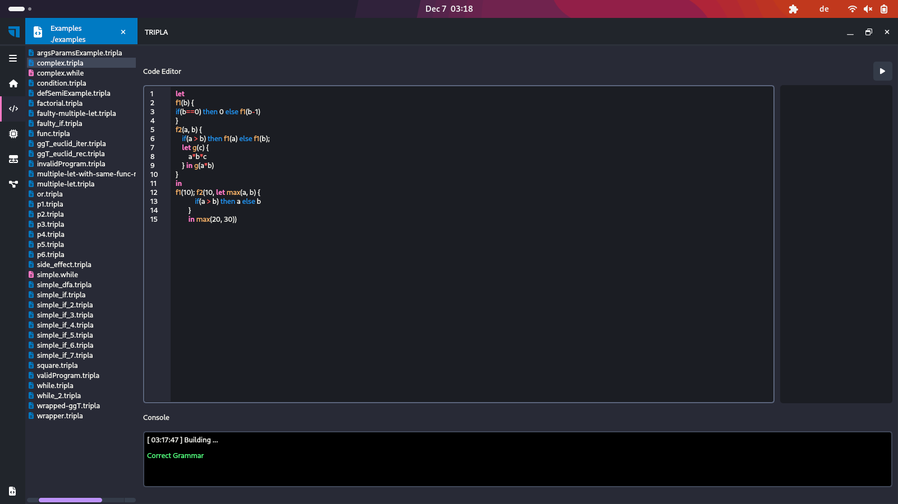
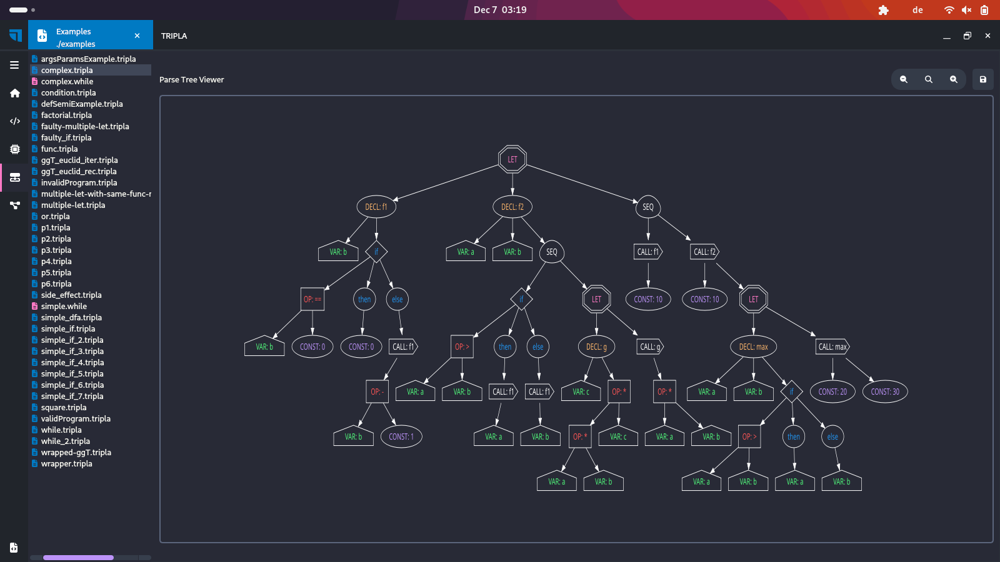

# Übersetzung und Analyse von Programmen

|                |                          |
|----------------|--------------------------|
| Name           | Pierre-Jordan de Amezaga |
| Matrikelnummer | 1133913                  |
| Email          | s4pideam@uni-trier.de    |

## Projekt 2

**Python Version:** 3.12.0

| Dependencies                                               | Version | Function                                                                                                                   |
|------------------------------------------------------------|---------|----------------------------------------------------------------------------------------------------------------------------|
| [PySide6](https://doc.qt.io/qtforpython-6/quickstart.html) | 6.6.0   | PySide6 ist das offizielle Python-Modul des Qt for Python-Projekts, das Zugang zum vollständigen Qt 6.0+ Framework bietet. |
| [graphviz](https://graphviz.org/)                          | 0.20.1  | Erstellung und Darstellung von Graphbeschreibungen in der DOT-Sprache der Graphviz-Software zur Graphenzeichnung           |
| [ply](https://www.dabeaz.com/ply/)                         | 3.11    | PLY ist eine Implementierung der Lex- und Yacc-Analysewerkzeuge für Python.                                                |


## Installation Graphviz

Graphviz benötigt die zusätzlichen binaries.

### Windows

```console
winget install graphviz
```

```console
setx PATH "%PATH%;C:\Program Files\Graphviz\bin"
```

### Debian/Ubuntu (apt):
```console
sudo apt-get install graphviz
```
### Red Hat/Fedora (dnf or yum):
```console
sudo dnf install graphviz
sudo yum install graphviz
```

### openSUSE (zypper):
```console
sudo zypper install graphviz
```

### Arch Linux (pacman):
```console
sudo pacman -S graphviz
```

### Alpine Linux (apk):
```console
sudo apk add graphviz
```

### macOS (Homebrew):
```console
brew install graphviz
```

## Installation Python Dependencies
### Unix/Windows/Mac:
```console
pip install -r requirements.txt
```

## Getting Starded
```console
python main.py
```


## Screenshots




